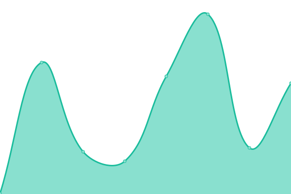

# [📈 Live Status](https://status.junglewp.io): <!--live status--> **🟩 All systems operational**

This repository contains the open-source uptime monitor and status page for [JungleWP Limited](https://junglewp.com), powered by [Upptime](https://github.com/upptime/upptime).

With [Upptime](https://upptime.js.org), you can get your own unlimited and free uptime monitor and status page, powered entirely by a GitHub repository. We use [Issues](https://github.com/junglewp/status/issues) as incident reports, [Actions](https://github.com/junglewp/status/actions) as uptime monitors, and [Pages](https://status.junglewp.io) for the status page.

<!--start: status pages-->
<!-- This summary is generated by Upptime (https://github.com/upptime/upptime) -->
<!-- Do not edit this manually, your changes will be overwritten -->
<!-- prettier-ignore -->
| URL | Status | History | Response Time | Uptime |
| --- | ------ | ------- | ------------- | ------ |
|  [Mainnet](https://www.junglewp.com) | 🟩 Up | [mainnet.yml](https://github.com/junglewp/status/commits/HEAD/history/mainnet.yml) | 

 283ms
     
 | 

<a href="https://status.junglewp.io/history/mainnet">100.00%</a>
    

|  [Testnet](https://testnet.devops.junglewp.io) | 🟩 Up | [testnet.yml](https://github.com/junglewp/status/commits/HEAD/history/testnet.yml) | 

 234ms
     
 | 

<a href="https://status.junglewp.io/history/testnet">100.00%</a>
    

|  [Support](https://docs.junglewp.com) | 🟩 Up | [support.yml](https://github.com/junglewp/status/commits/HEAD/history/support.yml) | 

 252ms
     
 | 

<a href="https://status.junglewp.io/history/support">100.00%</a>
    

|  [Community](https://teams.junglewp.io) | 🟩 Up | [community.yml](https://github.com/junglewp/status/commits/HEAD/history/community.yml) | 

 281ms
     
 | 

<a href="https://status.junglewp.io/history/community">100.00%</a>
    

<!--end: status pages-->

[**Visit our status website →**](https://status.junglewp.io)

## 📄 License

- Powered by: [Upptime](https://github.com/upptime/upptime)
- Code: [MIT](./LICENSE) © [JungleWP Limited](https://junglewp.com)
- Data in the `./history` directory: [Open Database License](https://opendatacommons.org/licenses/odbl/1-0/)
